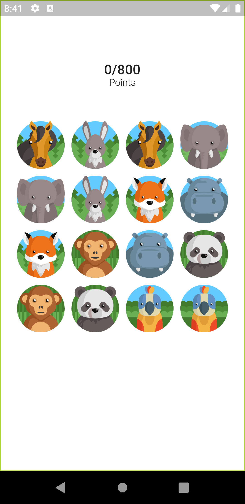
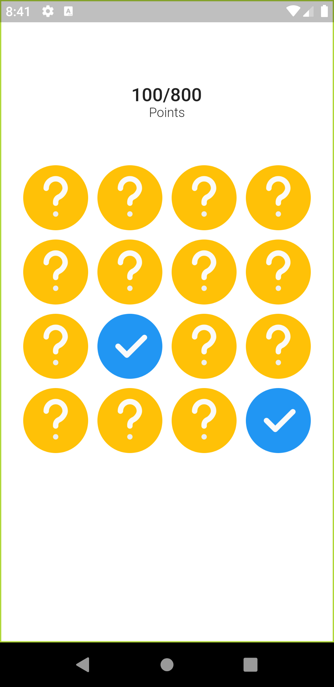

# Pairs

Pairs is a game built in flutter where once the player is allowed to see the images hidden behind the covers. And once it's done, the player is asked to uncover two plates which have same images sequally. 

## Screenshots

  

